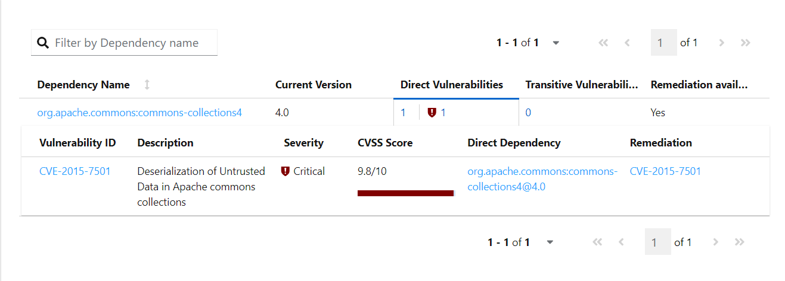

# Rapport sur l'implémentation de la Team Rocket

## Vulnérabilité de la Librairie

Il a été identifié que la librairie ajoutée (org.apache.commons.commons-collections4) présente une vulnérabilité. Cette vulnérabilité pourrait potentiellement être exploitée, compromettant ainsi la sécurité et la fiabilité de notre application.

[](https://nvd.nist.gov/vuln/detail/CVE-2015-7501)


## Échec des Tests Unitaires

L'implémentation actuelle ne passe pas les tests unitaires, ce qui empêche CircleCI de fonctionner correctement. Voici les erreurs rencontrées :

```
[ERROR] Failures: 
[ERROR]   RocketPokemonFactoryTest.testCreatePokemonExemple1:30 expected:<[Bulbasaur]> but was:<[MISSINGNO]>
[ERROR]   RocketPokemonFactoryTest.testCreatePokemonExemple2:50 expected:<[Aquali]> but was:<[MISSINGNO]>
[ERROR]   RocketPokemonFactoryTest.testCreatePokemonInvalidIndex Expected exception: java.lang.RuntimeException
[ERROR]   RocketPokemonFactoryTest.testCreatePokemonWithValidIndexStatRange Expected exception: java.lang.RuntimeException
```

## Non-conformité au Checkstyle

L'implémentation actuelle ne respecte également pas les règles de style de code définies par Checkstyle. Voici les erreurs relevées :

```
[ERROR] src/main/java/fr/univavignon/pokedex/imp/RocketPokemonFactory.java:[1] (misc) NewlineAtEndOfFile: File does not end with a newline.
[ERROR] src/main/java/fr/univavignon/pokedex/imp/RocketPokemonFactory.java:[26,37] (coding) MagicNumber: '1000000' is a magic number.
[ERROR] src/main/java/fr/univavignon/pokedex/imp/RocketPokemonFactory.java:[31,32] (coding) MagicNumber: '10000' is a magic number.
[ERROR] src/main/java/fr/univavignon/pokedex/imp/RocketPokemonFactory.java:[47,34] (coding) MagicNumber: '1000' is a magic number.
[ERROR] src/main/java/fr/univavignon/pokedex/imp/RocketPokemonFactory.java:[48,35] (coding) MagicNumber: '1000' is a magic number.
[ERROR] src/main/java/fr/univavignon/pokedex/imp/RocketPokemonFactory.java:[49,35] (coding) MagicNumber: '1000' is a magic number.
```

## Conclusion

Cette implémentation de la Team Rocket est actuellement vulnérable, non fonctionnelle et non conforme aux règles de style de code. On va donc la rejeter et demander à la Team Rocket de revoir son code.